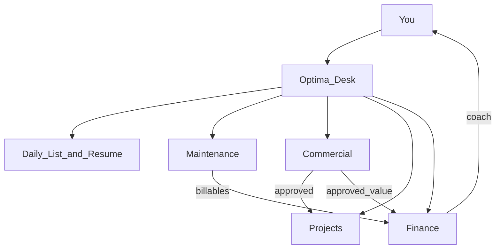

# Optima Desk — Product Requirements Document

**Product:** Optima Desk  
**Owner:** Webiton (solopreneur)  
**Stack:** Next.js (App Router) + TypeScript + HeroUI + Prisma + MySQL (cPanel)  
**UI language:** Portuguese  
**Currency:** EUR  
**Inbound email:** `requests@webiton.pt`  
**Repo folder:** `optima-desk`

---

## 1. Problem & goals

### Problem
Client requests, interventions, contracts, and project briefs get lost. Billing in 30‑minute slots against packs/retainers is unclear. Monthly client reports are manual. Side projects lack a path from brief → scope → proposal → build. Yearly/quarterly revenue goals are not visible day to day.

### Goals
1. Never lose a maintenance request or work log.
2. Bill accurately in **30‑minute** slots against retainer / pack / hourly.
3. One-click **monthly intervention reports** for clients.
4. **Client portal** with Kanban of their jobs.
5. Always-on desk: **Daily Job List**, Quick Log (nudge + voice), **day resume**.
6. **Side projects:** audio/email intake → scope + branded proposal → approval → build follow-up.
7. **Finance coach:** yearly goal + quarterly targets; pace and gap-to-goal actions.
8. Area **agents** help run the business; the owner updates clients and data.

---

## 2. Operating model (you vs agents)

| Who | Owns |
|-----|------|
| **You** | Manage clients, update status, log interventions, confirm proposals, approvals, work the daily list |
| **Daily desk** | Morning job list; evening “what I did today” resume |
| **Maintenance agent** | Draft reports/summaries; capture prompts — does not invent client facts |
| **Commercial agent** | Draft scopes/proposals from templates; you review and send |
| **Projects agent** | Break approved scope into build tasks; feed next actions to daily list |
| **Finance agent** | Goal coach: year/quarters, pace, € gap, concrete next actions |

**Principle:** Agents advise and draft. You commit data and client relationships. No silent fake logs or approvals.

---

## 3. Area agents

| Agent | In-app module | Cursor skill |
|-------|---------------|--------------|
| Maintenance | `/maintenance` | `skills/optima-maintenance` |
| Projects | `/projects` | `skills/optima-projects` |
| Commercial | `/commercial` | `skills/optima-commercial` |
| Finance | `/finance` | `skills/optima-finance` |

**Graphic** in Commercial = proposal presentation templates (branded layout), not maintenance design tasks. Maintenance still covers site features, debugging, copy, graphics tweaks, etc.

---

## 4. Two work tracks

| | Maintenance | Side project |
|--|-------------|--------------|
| Work | Bugs, small features, copy, graphics tweaks | Scoped deliverable / new build |
| Money | 30‑min vs pack / retainer / hourly | Fixed proposal via Commercial |
| Intake | Email, portal, Quick Log, voice | Audio and/or email brief |
| Client view | Ticket Kanban + hours + monthly report | Proposal status → build progress |
| Outcome | Intervention list + hours used | Approved scope, proposal, delivery |

Same **Client** can have both.

---

## 5. Daily Job List & day resume

### Daily Job List (home)
Auto-assembled for **today**:
- Maintenance: `in_progress`, your side of `waiting_on_client`, pinned/due items
- Projects: top next build tasks per active project
- Commercial: proposals `sent` awaiting reply
- Manual personal “today” items

Check off with optional confirm to update linked status.

### Day resume
- Interventions logged today (client, minutes, note)
- Tasks/requests completed or moved today
- Total hours today
- Short editable PT text summary (agent-drafted from data)

Nudge: “Something to log?” / later “Want today’s resume?”

---

## 6. Functional requirements by phase

### Phase 1 — Maintenance admin + daily desk
- Single admin auth
- CRUD clients + contracts (`retainer` | `pack` | `hourly`)
- Requests + Kanban (4 columns)
- Interventions in **0.5h** steps; deduct pack/retainer or mark billable
- Quick Log modal; idle nudge ~60–90 min
- Daily Job List + day resume
- Monthly report: client + month → text + intervention list (copy/download)
- HeroUI UI; Prisma + MySQL

### Phase 2 — Client portal
- Magic link; filtered Kanban; create request
- Hours remaining; published reports
- Client cannot freely redesign columns; status owned by admin

### Phase 3 — Voice + inbound email
- Voice → confirm card → intervention
- `requests@webiton.pt` → Request; match client by email/domain; else triage

### Phase 4 — Commercial + Projects
- Proposal templates (HTML branded layouts)
- Intake: paste email, record/upload audio → transcript
- Generate editable scope + proposal; send / approve / reject / revise
- On approve: build Kanban from deliverables
- New or existing client in flow
- Portal: view sent proposal; optional simple build progress

### Phase 5 — Finance coach
- Annual goal + Q1–Q4 targets (EUR)
- Actuals: maintenance billable value + approved proposal totals by quarter
- Pace, gap-to-goal, suggested levers (no invented revenue)

### Later
Stripe/invoices, multi-contact, WhatsApp, marketing leads

---

## 7. Status machines

**Maintenance Kanban:** `requested` → `in_progress` → `waiting_on_client` → `done`

**Project lifecycle:** `intake` → `scoping` → `proposal_sent` → `approved` → `in_build` → `delivered` | `cancelled`

**Build Kanban:** `todo` → `in_progress` → `waiting_on_client` → `done`

**Proposal:** `draft` → `sent` → `approved` | `rejected` | `revised`

---

## 8. Business rules

1. Intervention `minutes` is a positive multiple of **30**.
2. Active pack/retainer: logging deducts hours (`minutes / 60`).
3. Quick Log without open request creates `ad_hoc` request.
4. Commercial drafts only; human must review before send.
5. Finance never invents actuals; only reads logged interventions and approved proposals.
6. Agents never auto-write client records without user action.

---

## 9. Data model (Prisma)

### Shared
- `User` — `role`: `admin` | `client`; optional `clientId`
- `Client` — name, email, domain, notes

### Maintenance
- `Contract` — type, hoursTotal, hoursUsed, hourlyRate, startsAt, endsAt, active
- `Request` — clientId, title, description, status, source (`email` | `manual` | `portal` | `ad_hoc`), emailMessageId?
- `Intervention` — clientId, requestId, minutes, note, performedAt, createdBy
- `Report` — clientId, periodStart, periodEnd, body, published

### Commercial / Projects
- `Project`, `ProjectIntake` (audioUrl?, transcript, emailBody, source)
- `ProposalTemplate`, `ScopeDocument`, `Proposal`, `BuildTask`

### Finance
- `FinanceYear` (year, annualGoal)
- `FinanceQuarter` (yearId, quarter 1–4, target)

### Daily
- `DailyPlanItem` — date, title, optional link to request/task/proposal, done
- `DailyResume` — optional saved/edited snapshot for a date

Indexes: clientId, status, performedAt; unique emailMessageId when set.

---

## 10. Non-functional

- **UI:** [HeroUI](https://heroui.com/) v3 + Tailwind CSS v4
- **DB:** MySQL 8 on cPanel; `DATABASE_URL` in env
- **Deploy:** cPanel Setup Node.js App; prefer MySQL on localhost to the Node app
- **PWA:** installable always-open desk
- **Auth:** Auth.js — admin credentials + client magic link
- **i18n default:** `pt-PT`
- **Security:** RLS-by-query (client portal scoped to `clientId`); secrets in env only

---

## 11. Out of scope (early)

- Multi-admin org / separate human logins per “agent”
- Auto-send proposals without review
- Full graphic design studio / Canva clone
- Bank sync, tax packing
- Agents replacing you as client manager

---

## 12. Acceptance criteria

### Phase 1
- Pack 10h; two 30‑min logs → 9.0h remaining
- Quick Log without request → ad_hoc on Kanban
- Nudge opens Quick Log
- Daily list shows open work + manual pin
- Day resume lists interventions, hours, short PT summary
- Monthly report lists interventions for month
- App runs with Prisma against MySQL

### Phase 4
- Audio/email intake → draft from template → edit → sent → approved → build tasks

### Phase 5
- Year + quarters set; approved proposal + maintenance appear in actuals; behind-pace shows € gap + actions

---

## 13. Implementation order

1. This PRD + Cursor skills  
2. Scaffold Next.js + HeroUI + Prisma schema  
3. Phase 1 → 2 → 3 → 4 → 5  

---

## 14. Defaults

| Setting | Value |
|---------|--------|
| UI language | Portuguese |
| Currency | EUR |
| Nudge interval | 60–90 minutes |
| Time slot | 30 minutes |
| Product name | Optima Desk |
| Business email | requests@webiton.pt |
